# spade Design System

You are building UI for **spade**. Dark-themed, neutral palette, monospace typography (Georgia), compact density on a 4px grid.

## Visual Reference

**IMPORTANT**: Study ALL screenshots below before writing any UI. Match colors, typography, spacing, layout, and motion exactly as shown.

### Homepage

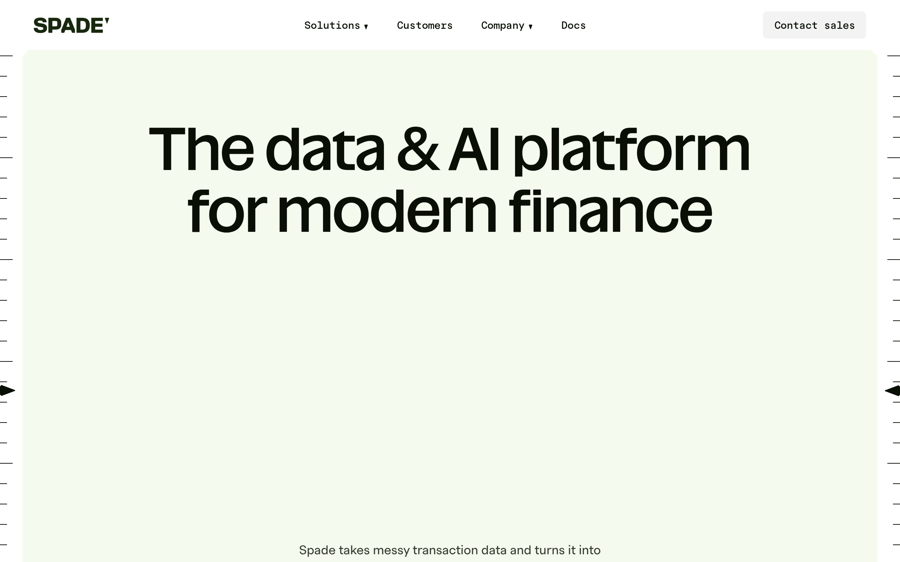

### Scroll Journey (Cinematic Visual States)

> These screenshots capture the website at different scroll depths. The design changes dramatically as you scroll — each frame shows a different cinematic state. Replicate these exact visual transitions.

#### 0% — Hero / Above the fold


#### 17% — Mid-page at 17% scroll


#### 33% — Mid-page at 33% scroll


#### 50% — Mid-page at 50% scroll


#### 67% — Mid-page at 67% scroll


#### 83% — Mid-page at 83% scroll


#### 100% — Footer / End of page


> Read `references/DESIGN.md` for full token details. Read `references/ANIMATIONS.md` for motion specs. Read `references/LAYOUT.md` for layout structure. Read `references/COMPONENTS.md` for component patterns.

## Ultra Reference Files

This package includes extended documentation. **Read these files before implementing:**

| File | Contents |
|------|----------|
| `references/DESIGN.md` | Full design system tokens, colors, typography, spacing |
| `references/VISUAL_GUIDE.md` | **START HERE** — Master visual guide with all screenshots embedded |
| `references/ANIMATIONS.md` | CSS keyframes, scroll triggers, motion library stack, video specs |
| `references/LAYOUT.md` | Flex/grid containers, page structure, spacing relationships |
| `references/COMPONENTS.md` | DOM component patterns, HTML structure, class fingerprints |
| `references/INTERACTIONS.md` | Hover/focus states with before/after style diffs |
| `screens/scroll/` | 7 scroll journey screenshots showing cinematic states |

## Design Philosophy

- **Layered depth** — use shadow tokens to create a sense of physical layering. Each elevation level has a specific shadow.
- **Gradient accents** — gradients are used thoughtfully for emphasis, not decoration.
- **Single typeface** — Georgia carries all text. Hierarchy comes from size, weight, and color — never font mixing.
- **compact density** — 4px base grid. Every dimension is a multiple of 4.
- **neutral palette** — the color temperature runs neutral, matching the monospace typography.
- **Subtle motion** — transitions smooth state changes. Keep durations under 300ms, use ease-out curves.

## Color System

### Core Palette

| Role | Token | Hex | Use |
|------|-------|-----|-----|
| Background | `--background` | `#090f05` | Page/app background |
| Surface | `--surface` | `#3f7308` | Cards, panels, modals |
| Text Primary | `--text-primary` | `#ffffff` | Headings, body text |
| Text Muted | `--text-muted` | `#4a5b38` | Captions, placeholders |

### Status Colors

| Status | Hex | Use |
|--------|-----|-----|
| Success | `#18280e` | Confirmations, positive trends |
| Warning | `#ebe46a` | Caution states, pending items |
| Danger | `#331b09` | Errors, destructive actions |

### Extended Palette

- **color-sage-3:** `#d8e5ca`
- **swiper-preloader-color:** `#000000` — Deep background layer or shadow color
- **color-lemongrass:** `#b2eb76`
- **color-sage-1:** `#f4faed` — Light surface or highlight color
- **color-gray-500:** `#6a7282`
- **tw-ring-color:** `#155dfc`
- **color-rock:** `#a0967a`
- **color-sage-4:** `#b3c5a0`

### CSS Variable Tokens

```css
--card: #F4FAED;
```

## Typography

### Font Stack

- **Georgia** — Heading 1, Heading 2
- **SFMono-Regular** — Body, Caption, Code

### Font Sources

```css
@font-face {
  font-family: "naNSuperX";
  src: url("fonts/naNSuperX-100.woff2") format("woff2");
  font-weight: 100;
}
@font-face {
  font-family: "polar";
  src: url("fonts/polar-Regular.woff2") format("woff2");
  font-weight: 400;
}
@font-face {
  font-family: "polarMono";
  src: url("fonts/polarMono-Regular.woff2") format("woff2");
  font-weight: 400;
}
```

### Type Scale

| Role | Family | Size | Weight |
|------|--------|------|--------|
| Heading 1 | Georgia | 48px | 700 |
| Heading 2 | Georgia | 28px | 700 |
| Body | SFMono-Regular | clamp(min(var(--mobile-font-size),var(--desktop-font-size)),calc((var(--vi-multiplier)*100vi) + (var(--base-offset)/16*1rem)),max(var(--mobile-font-size),var(--desktop-font-size))) | 400 |
| Caption | SFMono-Regular | calc((var(--vi-multiplier)*640 + var(--base-offset))/16*1rem) | 400 |
| Code | SFMono-Regular | 14px | 400 |

### Typography Rules

- All text uses **Georgia** — never add another font family
- Max 3-4 font sizes per screen
- Headings: weight 600-700, body: weight 400
- Use color and opacity for text hierarchy, not additional font sizes
- Line height: 1.5 for body, 1.2 for headings

## Spacing & Layout

### Base Grid: 4px

Every dimension (margin, padding, gap, width, height) must be a multiple of **4px**.

### Spacing Scale

`2, 4, 6, 8, 10, 12, 14, 16, 18, 20, 22, 24` px

### Spacing as Meaning

| Spacing | Use |
|---------|-----|
| 4-8px | Tight: related items (icon + label, avatar + name) |
| 12-16px | Medium: between groups within a section |
| 24-32px | Wide: between distinct sections |
| 48px+ | Vast: major page section breaks |

### Border Radius

Scale: `.25rem, .3125rem, .375rem, 4px, 6px, 20px, 100%`
Default: `4px`

### Container

Max-width: `68.5rem`, centered with auto margins.

### Breakpoints

| Name | Value |
|------|-------|
| sm | 40rem |
| md | 48rem |
| lg | 64rem |
| xl | 80rem |
| 2xl | 96rem |
| xs | 390px |
| sm | 640px |
| md | 768px |
| lg | 1000px |
| lg | 1024px |
| xl | 1280px |
| 2xl | 1300px |
| 2xl | 1440px |
| 2xl | 1520px |
| 2xl | 1680px |
| 2xl | 1920px |
| 2xl | 2240px |
| 2xl | 2560px |

Mobile-first: design for small screens, layer on responsive overrides.

## Component Patterns

### Card

```css
.card {
  background: #3f7308;
  border-radius: 4px;
  padding: 16px;
  box-shadow: 0 0 0 1px var(--tw-prose-kbd-shadows),0 3px 0 var(--tw-prose-kbd-shadows);
}
```

```html
<div class="card">
  <h3>Card Title</h3>
  <p>Card content goes here.</p>
</div>
```

### Button

```css
/* Primary */
.btn-primary {
  background: #444444;
  color: #ffffff;
  border-radius: 4px;
  padding: 8px 16px;
  font-weight: 500;
  transition: opacity 150ms ease;
}
.btn-primary:hover { opacity: 0.9; }

/* Ghost */
.btn-ghost {
  background: transparent;
  border: 1px solid #444444;
  color: #ffffff;
  border-radius: 4px;
  padding: 8px 16px;
}
```

```html
<button class="btn-primary">Get Started</button>
<button class="btn-ghost">Learn More</button>
```

### Input

```css
.input {
  background: #090f05;
  border: 1px solid #444444;
  border-radius: 4px;
  padding: 8px 12px;
  color: #ffffff;
  font-size: 14px;
}
.input:focus { border-color: var(--accent); outline: none; }
```

```html
<input class="input" type="text" placeholder="Search..." />
```

### Badge / Chip

```css
.badge {
  display: inline-flex;
  align-items: center;
  padding: 4px 8px;
  border-radius: 9999px;
  font-size: 12px;
  font-weight: 500;
  background: #3f7308;
  color: #4a5b38;
}
```

```html
<span class="badge">New</span>
<span class="badge">Beta</span>
```

### Modal / Dialog

```css
.modal-backdrop { background: rgba(0, 0, 0, 0.6); }
.modal {
  background: #3f7308;
  border-radius: 100%;
  padding: 24px;
  max-width: 480px;
  width: 90vw;
  box-shadow: 0 0 0 1px var(--tw-prose-kbd-shadows),0 3px 0 var(--tw-prose-kbd-shadows);
}
```

```html
<div class="modal-backdrop">
  <div class="modal">
    <h2>Dialog Title</h2>
    <p>Dialog content.</p>
    <button class="btn-primary">Confirm</button>
    <button class="btn-ghost">Cancel</button>
  </div>
</div>
```

### Table

```css
.table { width: 100%; border-collapse: collapse; }
.table th {
  text-align: left;
  padding: 8px 12px;
  font-weight: 500;
  font-size: 12px;
  color: #4a5b38;
  text-transform: uppercase;
  letter-spacing: 0.05em;
  border-bottom: 1px solid #444444;
}
.table td {
  padding: 12px;
  border-bottom: 1px solid #444444;
}
```

```html
<table class="table">
  <thead><tr><th>Name</th><th>Status</th><th>Date</th></tr></thead>
  <tbody>
    <tr><td>Item One</td><td>Active</td><td>Jan 1</td></tr>
    <tr><td>Item Two</td><td>Pending</td><td>Jan 2</td></tr>
  </tbody>
</table>
```

### Navigation

```css
.nav {
  display: flex;
  align-items: center;
  gap: 8px;
  padding: 12px 16px;
}
.nav-link {
  color: #4a5b38;
  padding: 8px 12px;
  border-radius: 4px;
  transition: color 150ms;
}
.nav-link:hover { color: #ffffff; }
```

```html
<nav class="nav">
  <a href="/" class="nav-link active">Home</a>
  <a href="/about" class="nav-link">About</a>
  <a href="/pricing" class="nav-link">Pricing</a>
  <button class="btn-primary" style="margin-left: auto">Get Started</button>
</nav>
```

### Extracted Components

These components were found in the codebase:

**Button** (`html`)

**Input** (`html`)

**Card** (`html`)
- Variants: `asset`

**Navigation** (`html`)

## Page Structure

The following page sections were detected:

- **Navigation** — Top navigation bar (2 items)
- **Hero** — Hero section (detected from heading structure)
- **Footer** — Page footer with links and info (18 items)
- **Cta** — Call-to-action section
- **Cards** — Grid of 4 card elements (4 items)

When building pages, follow this section order and structure.

## Animation & Motion

This project uses **subtle motion**. Transitions smooth state changes without calling attention.

### CSS Animations

- `marquee`
- `swiper-preloader-spin`

### Motion Tokens

- **Duration scale:** `.15s`, `.2s`, `.225s`, `.25s`, `.3s`, `.5s`, `200ms`
- **Animated properties:** `opacity`

### Motion Guidelines

- **Duration:** Use values from the duration scale above. Short (.15s) for micro-interactions, long (200ms) for page transitions
- **Easing:** `ease-out` for enters, `ease-in` for exits
- **Direction:** Elements enter from bottom/right, exit to top/left
- **Reduced motion:** Always respect `prefers-reduced-motion` — disable animations when set

## Depth & Elevation

### Shadow Tokens

- Subtle: `rgba(0, 0, 0, 0) 0px 0px 0px 0px, rgba(0, 0, 0, 0) 0px 0px 0px 0px, rgba(0, 0, 0, 0) 0px 0px 0px 0px, rgb(255, 255, 255) 0px 0px 0px 0px, rgba(0, 0, 0, 0) 0px 0px 0px 0px`
- Raised (cards, buttons): `0 0 0 1px var(--tw-prose-kbd-shadows),0 3px 0 var(--tw-prose-kbd-shadows)`

### Z-Index Scale

`0, 1, 2, 3, 5, 10, 40, 50, 52, 60, 70, 100, 9999`

Use these exact values — never invent z-index values.

## Anti-Patterns (Never Do)

- **No blur effects** — no backdrop-blur, no filter: blur()
- **No zebra striping** — tables and lists use borders for separation
- **No invented colors** — every hex value must come from the palette above
- **No arbitrary spacing** — every dimension is a multiple of 4px
- **No extra fonts** — only Georgia and SFMono-Regular are allowed
- **No arbitrary border-radius** — use the scale: .25rem, .3125rem, .375rem, 4px, 6px, 20px
- **No opacity for disabled states** — use muted colors instead

## Workflow

1. **Read** `references/DESIGN.md` before writing any UI code
2. **Pick colors** from the Color System section — never invent new ones
3. **Set typography** — Georgia, SFMono-Regular only, using the type scale
4. **Build layout** on the 4px grid — check every margin, padding, gap
5. **Match components** to patterns above before creating new ones
6. **Apply elevation** — use shadow tokens
7. **Validate** — every value traces back to a design token. No magic numbers.

## Brand Spec

- **Favicon:** `/favicons/apple-touch-icon.png`
- **Site URL:** `https://spade.com/`
- **Brand typeface:** Georgia

## Quick Reference

```
Background:     #090f05
Surface:        #3f7308
Text:           #ffffff / #4a5b38
Accent:         (not extracted)
Border:         (not extracted)
Font:           Georgia
Spacing:        4px grid
Radius:         4px
Components:     7 detected
```

## When to Trigger

Activate this skill when:
- Creating new components, pages, or visual elements for spade
- Writing CSS, Tailwind classes, styled-components, or inline styles
- Building page layouts, templates, or responsive designs
- Reviewing UI code for design consistency
- The user mentions "spade" design, style, UI, or theme
- Generating mockups, wireframes, or visual prototypes

---

# Full Reference Files

> Every output file is embedded below. Claude has full design system context from /skills alone.

## Design System Tokens (DESIGN.md)

# spade DESIGN.md

> Auto-generated design system — reverse-engineered via static analysis by skillui.
> Frameworks: None detected
> Colors: 20 · Fonts: 2 · Components: 7
> Icon library: not detected · State: not detected
> Primary theme: dark · Dark mode toggle: no · Motion: subtle

## Visual Reference

**Match this design exactly** — study colors, fonts, spacing, and component shapes before writing any UI code.


---

## 1. Visual Theme & Atmosphere

This is a **dark-themed** interface with a neutral tone. Depth is expressed through layered shadows and subtle surface color variation. Typography uses **Georgia** throughout — a technical, developer-focused choice that maintains consistency. Spacing follows a **4px base grid** (compact density), with scale: 2, 4, 6, 8, 10, 12, 14, 16px. Motion is subtle — smooth transitions (150-300ms) ease state changes without drawing attention.

---

## 2. Color Palette & Roles

| Token | Hex | Role | Use |
|---|---|---|---|
| color-black | `#090f05` | background | Page background, darkest surface |
| color-moss | `#3f7308` | surface | Card and panel backgrounds |
| theme-color | `#ffffff` | text-primary | Headings and body text |
| color-sage-5 | `#4a5b38` | text-muted | Captions, placeholders, secondary info |
| color-earth | `#331b09` | danger | Error states, destructive actions |
| color-forest | `#18280e` | success | Success states, positive indicators |
| color-sun | `#ebe46a` | warning | Warning states, caution indicators |
| tw-ring-color | `#155dfc` | info | Informational highlights |
| color-sage-3 | `#d8e5ca` | unknown | Palette color |
| swiper-preloader-color | `#000000` | unknown | Palette color |
| color-lemongrass | `#b2eb76` | unknown | Palette color |
| color-sage-1 | `#f4faed` | unknown | Palette color |
| color-gray-500 | `#6a7282` | unknown | Palette color |
| color-rock | `#a0967a` | unknown | Palette color |
| color-sage-4 | `#b3c5a0` | unknown | Palette color |
| color-gray-300 | `#d1d5dc` | unknown | Palette color |
| tw-prose-quote-borders | `#e5e7eb` | unknown | Palette color |
| tw-prose-invert-quote-borders | `#364153` | unknown | Palette color |
| color-sand | `#f2dfac` | unknown | Palette color |
| color-red-500 | `#fb2c36` | unknown | Palette color |

### CSS Variable Tokens

```css
--tw-border-style: solid;
--tw-prose-quote-borders: #e5e7eb;
--tw-prose-th-borders: #d1d5dc;
--tw-prose-td-borders: #e5e7eb;
--tw-prose-invert-quote-borders: #364153;
--tw-prose-invert-th-borders: #4a5565;
--tw-prose-invert-td-borders: #364153;
--tw-prose-quote-borders: lab(91.6229% -.159115-2.26791);
--tw-prose-th-borders: lab(85.1236% -.612259-3.7138);
--tw-prose-td-borders: lab(91.6229% -.159115-2.26791);
--tw-prose-invert-quote-borders: lab(27.1134% -.956401-12.3224);
--tw-prose-invert-th-borders: lab(35.6337% -1.58697-10.8425);
--tw-prose-invert-td-borders: lab(27.1134% -.956401-12.3224);
--tw-border-style: dashed;
--tw-border-style: solid;
--tw-prose-quote-borders: #e5e7eb;
--tw-prose-th-borders: #d1d5dc;
--tw-prose-td-borders: #e5e7eb;
--tw-prose-invert-quote-borders: #364153;
--tw-prose-invert-th-borders: #4a5565;
```


---

## 3. Typography Rules

**Font Stack:**
- **Georgia** — Heading 1, Heading 2
- **SFMono-Regular** — Body, Caption, Code

**Font Sources:**

```css
@font-face {
  font-family: "naNSuperX";
  src: url("fonts/naNSuperX-100.woff2") format("woff2");
  font-weight: 100;
}
@font-face {
  font-family: "polar";
  src: url("fonts/polar-Regular.woff2") format("woff2");
  font-weight: 400;
}
@font-face {
  font-family: "polarMono";
  src: url("fonts/polarMono-Regular.woff2") format("woff2");
  font-weight: 400;
}
```

| Role | Font | Size | Weight |
|---|---|---|---|
| Heading 1 | Georgia | 48px | 700 |
| Heading 2 | Georgia | 28px | 700 |
| Body | SFMono-Regular | clamp(min(var(--mobile-font-size),var(--desktop-font-size)),calc((var(--vi-multiplier)*100vi) + (var(--base-offset)/16*1rem)),max(var(--mobile-font-size),var(--desktop-font-size))) | 400 |
| Caption | SFMono-Regular | calc((var(--vi-multiplier)*640 + var(--base-offset))/16*1rem) | 400 |
| Code | SFMono-Regular | 14px | 400 |

**Typographic Rules:**
- Use **Georgia** for all text — do not mix font families
- Maintain consistent hierarchy: no more than 3-4 font sizes per screen
- Headings use bold (600-700), body uses regular (400)
- Line height: 1.5 for body text, 1.2 for headings
- Use color and opacity for secondary hierarchy, not additional font sizes


---

## 4. Component Stylings

### Layout (1)

**Footer** — `html`

### Navigation (1)

**Navigation** — `html`

### Data Display (1)

**Card** — `html`
- Variants: `asset`

### Data Input (2)

**Button** — `html`
- Animation: 

**Input** — `html`
- State: :focus, :placeholder

### Media (2)

**Image** — `html`

**Icon** — `html`


---

## 5. Layout Principles

- **Base spacing unit:** 4px
- **Spacing scale:** 2, 4, 6, 8, 10, 12, 14, 16, 18, 20, 22, 24
- **Border radius:** .25rem, .3125rem, .375rem, 4px, 6px, 20px, 100%
- **Max content width:** 68.5rem

**Spacing as Meaning:**
| Spacing | Use |
|---|---|
| 4-8px | Tight: related items within a group |
| 12-16px | Medium: between groups |
| 24-32px | Wide: between sections |
| 48px+ | Vast: major section breaks |


---

## 6. Depth & Elevation

### Flat — subtle depth hints

- `rgba(0, 0, 0, 0) 0px 0px 0px 0px, rgba(0, 0, 0, 0) 0px 0px 0px 0px, rgba(0, 0, 0, 0) 0px 0px 0px 0px, rgb(255, 255, 255) 0px 0px 0px 0px, rgba(0, 0, 0, 0) 0px 0px 0px 0px`

### Raised — cards, buttons, interactive elements

- `0 0 0 1px var(--tw-prose-kbd-shadows),0 3px 0 var(--tw-prose-kbd-shadows)`

### Z-Index Scale

`0, 1, 2, 3, 5, 10, 40, 50, 52, 60, 70, 100, 9999`


---

## 7. Animation & Motion

This project uses **subtle motion**. Transitions smooth state changes without demanding attention.

### CSS Animations

- `@keyframes marquee`
- `@keyframes swiper-preloader-spin`

### Animated Components

- **Button**: 

### Motion Guidelines

- Duration: 150-300ms for micro-interactions, 300-500ms for page transitions
- Easing: `ease-out` for enters, `ease-in` for exits
- Always respect `prefers-reduced-motion`


---

## 8. Do's and Don'ts

### Do's

- Use `#090f05` as the primary page background
- Use **Georgia** for all UI text
- Follow the **4px** spacing grid for all margins, padding, and gaps
- Use the defined shadow tokens for elevation — see Section 6
- Use border-radius from the scale: .25rem, .3125rem, .375rem, 4px, 6px
- Reuse existing components from Section 4 before creating new ones

### Don'ts

- Don't introduce colors outside this palette — extend the design tokens first
- Don't mix font families — use Georgia consistently
- Don't use arbitrary spacing values — stick to multiples of 4px
- Don't create custom box-shadow values outside the system tokens
- Don't use arbitrary border-radius values — pick from the defined scale
- Don't duplicate component patterns — check Section 4 first
- Don't use backdrop-blur or blur effects

### Anti-Patterns (detected from codebase)

- No blur or backdrop-blur effects
- No zebra striping on tables/lists


---

## 9. Responsive Behavior

| Name | Value | Source |
|---|---|---|
| sm | 40rem | css |
| md | 48rem | css |
| lg | 64rem | css |
| xl | 80rem | css |
| 2xl | 96rem | css |
| xs | 390px | css |
| sm | 640px | css |
| md | 768px | css |
| lg | 1000px | css |
| lg | 1024px | css |
| xl | 1280px | css |
| 2xl | 1300px | css |
| 2xl | 1440px | css |
| 2xl | 1520px | css |
| 2xl | 1680px | css |
| 2xl | 1920px | css |
| 2xl | 2240px | css |
| 2xl | 2560px | css |

**Approach:** Use `@media (min-width: ...)` queries matching the breakpoints above.


---

## 10. Agent Prompt Guide

Use these as starting points when building new UI:

### Build a Card

```
Background: #3f7308
Border: 1px solid var(--border)
Radius: 4px
Padding: 16px
Font: Georgia
Use shadow tokens from Section 6.
```

### Build a Button

```
Primary: bg var(--accent), text white
Ghost: bg transparent, border var(--border)
Padding: 8px 16px
Radius: 4px
Hover: opacity 0.9 or lighter shade
Focus: ring with var(--accent)
```

### Build a Page Layout

```
Background: #090f05
Max-width: 68.5rem, centered
Grid: 4px base
Responsive: mobile-first, breakpoints from Section 9
```

### Build a Stats Card

```
Surface: #3f7308
Label: #4a5b38 (muted, 12px, uppercase)
Value: #ffffff (primary, 24-32px, bold)
Status: use success/warning/danger from Section 2
```

### Build a Form

```
Input bg: #090f05
Input border: 1px solid var(--border)
Focus: border-color var(--accent)
Label: #4a5b38 12px
Spacing: 16px between fields
Radius: 4px
```

### General Component

```
1. Read DESIGN.md Sections 2-6 for tokens
2. Colors: only from palette
3. Font: Georgia, type scale from Section 3
4. Spacing: 4px grid
5. Components: match patterns from Section 4
6. Elevation: shadow tokens
```

## Visual Guide — Screenshots (VISUAL_GUIDE.md)

# spade — Visual Guide

> Master visual reference. Study every screenshot carefully before implementing any UI.
> Match colors, layout, typography, spacing, and motion states exactly.

## Scroll Journey

The page has cinematic scroll animations. Each screenshot below shows the exact visual state at that scroll depth.
**Replicate these transitions precisely** — the design changes dramatically as you scroll.

### Hero — Above the fold

*Scroll position: 0px of 14088px total*


### 17% scroll depth

*Scroll position: 2242px of 14088px total*


### 33% scroll depth

*Scroll position: 4352px of 14088px total*


### 50% scroll depth

*Scroll position: 6594px of 14088px total*


### 67% scroll depth

*Scroll position: 8836px of 14088px total*


### 83% scroll depth

*Scroll position: 10946px of 14088px total*


### Footer — End of page

*Scroll position: 13188px of 14088px total*


## Full Page Screenshots

### The data & AI platform for modern finance | Spade

*URL: `https://spade.com/`*


### Customers | Spade

*URL: `https://spade.com/customers/`*


### Contact | Spade

*URL: `https://spade.com/contact/`*


### Risk & Authorization | Spade

*URL: `https://spade.com/use-case/risk-authorization/`*


### Rewards & Attribution | Spade

*URL: `https://spade.com/use-case/rewards-and-attribution/`*


## Section Screenshots

Clipped sections showing individual components in context.

### Section 1 — `section`

*1440×976px*


### Section 1 — `section`

*1440×1012px*


### Section 1 — `section`

*1440×912px*


### Section 1 — `section`

*1440×745px*


### Section 2 — `section`

*1440×244px*


### Section 1 — `section`

*1440×1144px*


## Animations & Motion (ANIMATIONS.md)

# Animation Reference

> Cinematic motion design extracted from live DOM. Follow these specs exactly to recreate the experience.

## Motion Technology Stack

| Library | Type | Notes |
|---------|------|-------|
| Canvas (1 elements) | 2D Canvas | 2D canvas rendering |

## Scroll Journey

The page is **14,088px** tall. Each frame below shows what the user sees at that scroll depth.

> **Use these screenshots to understand WHAT animates, WHEN it animates, and HOW it moves.**

### 0% — Top / Hero
Scroll position: 0px


### 17% — Opening Section
Scroll position: 2,242px


### 33% — First Feature Section
Scroll position: 4,352px


### 50% — Mid-Page
Scroll position: 6,594px


### 67% — Lower Content
Scroll position: 8,836px


### 83% — Near Footer
Scroll position: 10,946px


### 100% — Bottom / Footer
Scroll position: 13,188px


## Video Elements

| # | Role | Autoplay | Loop | Muted | Size | First Frame |
|---|------|----------|------|-------|------|-------------|
| 1 | content | — | — | ✓ | 340×360 | — |

- **Source:** `blob:https://spade.com/c16ff774-f433-4bf6-9a5c-db6c28347d4d`

## Scroll Animation Patterns

| Pattern | Library | Element Count | Duration | Delay | Easing |
|---------|---------|---------------|----------|-------|--------|
| parallax / sticky scroll | CSS | 4 | — | — | — |

### CSS Implementation

## CSS Keyframes (2 extracted)

### `@keyframes swiper-preloader-spin`

Duration: `1s` · Easing: `linear` · Delay: `0s` · Iteration: `infinite` · Fill: `none`

Used by: `:is(.swiper:not(.swiper-watch-progress), .swiper-watch-progress .swiper-slide-vi`

```css
@keyframes swiper-preloader-spin {
  0% {
    transform: rotate(0deg);
  }
  100% {
    transform: rotate(360deg);
  }
}
```

> Transform/motion animation

### `@keyframes marquee`

```css
@keyframes marquee {
  0% {
    transform: translate(0px);
  }
  100% {
    transform: translate(calc(-100% - 2rem));
  }
}
```

> Transform/motion animation

## Motion Tokens (CSS Variables)

### Duration Tokens

```css
--default-transition-duration: .25s;
```

### Easing Tokens

```css
--default-transition-timing-function: cubic-bezier(.4,0,.2,1);
--ease-out: cubic-bezier(0,0,.2,1);
--ease-in-out: cubic-bezier(.4,0,.2,1);
```

## Global Transition Declarations

These `transition` values were extracted from CSS rules across the site:

```css
transition: opacity 0.2s;
```

## How to Recreate This Motion Design

### Step 2 — Scroll-Reveal Pattern

Elements that animate into view follow this pattern:

```css
/* Initial hidden state */
.reveal {
  opacity: 0;
  transform: translateY(40px);
  transition: opacity .25s cubic-bezier(.4,0,.2,1),
              transform .25s cubic-bezier(.4,0,.2,1);
}
.reveal.visible {
  opacity: 1;
  transform: translateY(0);
}
```

### Step 3 — Key Motion Principles

- **Canvas elements (1)** — animated via requestAnimationFrame loop. Use canvas for particle effects, gradient animations, and WebGL scenes
- **Duration scale:** `.25s` · `0.2s` — use these values, never invent new durations
- **Always add** `@media (prefers-reduced-motion: reduce) { * { animation-duration: 0.01ms !important; transition-duration: 0.01ms !important; } }`

### Step 4 — Scroll Journey Reference

Match what happens at each scroll position:

- **0%** (`0px`) → `screens/scroll/scroll-000.png`
- **17%** (`2242px`) → `screens/scroll/scroll-017.png`
- **33%** (`4352px`) → `screens/scroll/scroll-033.png`
- **50%** (`6594px`) → `screens/scroll/scroll-050.png`
- **67%** (`8836px`) → `screens/scroll/scroll-067.png`
- **83%** (`10946px`) → `screens/scroll/scroll-083.png`
- **100%** (`13188px`) → `screens/scroll/scroll-100.png`

## Layout & Grid (LAYOUT.md)

# Layout Reference

> Auto-extracted from live DOM. Use this to understand how the site is structured spatially.

## Spacing System

**Base grid:** 4px

**Scale:** `2, 4, 6, 8, 10, 12, 14, 16, 18, 20, 22, 24, 26, 28, 32` px

| Spacing | Semantic Use |
|---------|-------------|
| 4px | Tight — within a component |
| 8px | Medium — between sibling items |
| 16px | Wide — between sections |
| 32px | Vast — major section breaks |

## Flex Layouts

| Element | Direction | Justify | Align | Gap | Children |
|---------|-----------|---------|-------|-----|----------|
| `div.flex.h-full` | row | space-between | center | normal 32px | 4 |
| `div.flex.gap-x-4` | row | — | — | normal 16px | 1 |
| `div.flex.flex-col` | column | — | center | 40px | 2 |
| `div.two-column-content.flex` | row | space-between | end | 40px | 2 |
| `div.flex.w-full` | column | — | center | — | 1 |
| `div.two-column-content.flex` | row-reverse | space-between | end | 40px | 2 |
| `div.two-column-content.flex` | row | space-between | center | 40px | 2 |
| `div.relative.mx-auto` | column | — | center | 40px normal | 4 |
| `div.mx-auto.flex` | column | — | center | — | 4 |
| `div.sticky.top-0` | column | center | center | — | 5 |
| `div.text-card.flex` | column | — | center | — | 4 |
| `div.relative.flex` | row | — | — | — | 1 |
| `div.relative.z-1` | row | — | — | 40px | 2 |
| `div.relative.flex` | column | center | center | — | 3 |
| `div.mt-12.flex` | row | — | start | normal 24px | 2 |

## Grid Layouts

| Element | Template Columns | Gap | Children |
|---------|-----------------|-----|----------|
| `div.grid.w-full` | `168px 168px 168px 168px 168px 168px 168px` | 24px | 14 |

## Structural Containers

### `<header>` (`header.sticky.inset-x-0`)

```
display:          block
children:         1
```

### `<main>` 

```
display:          block
children:         9
```

### `<footer>` (`footer.relative.overflow-hidden`)

```
display:          block
children:         4
```

### `<section>` (`section.relative.overflow-hidden`)

```
display:          block
padding:          0px 32px
children:         4
```

### `<section>` (`section.relative.overflow-hidden`)

```
display:          block
padding:          80px 0px
children:         1
```

### `<section>` (`section.relative.overflow-visible`)

```
display:          block
padding:          0px 32px
children:         1
```

### `<section>` (`section.relative.overflow-hidden`)

```
display:          block
padding:          164px 0px 0px
children:         1
```

### `<section>` (`section.relative.overflow-hidden`)

```
display:          block
padding:          164px 0px 144px
children:         1
```

### `<section>` (`section.relative.overflow-hidden`)

```
display:          block
children:         1
```

### `<section>` (`section.relative.overflow-x-clip`)

```
display:          block
children:         1
```

### `<section>` (`section.relative.overflow-hidden`)

```
display:          block
padding:          128px 0px
children:         1
```

### `<section>` (`section.relative.overflow-hidden`)

```
display:          block
padding:          164px 0px
children:         1
```

## Layout Rules

- **Container max-width:** `1416px` — always center with `margin: auto`
- Primary layout system: **Flexbox**
- Secondary layout system: **CSS Grid** (used for card grids and multi-column layouts)
- Every spacing value must be a multiple of **4px**
- Never use arbitrary margin/padding values outside the spacing scale

## Component Patterns (COMPONENTS.md)

# Component Reference

> Repeated DOM patterns detected by structural analysis. Each component appeared 3+ times.

## Detected Components

| Component | Category | Instances | Key Classes |
|-----------|----------|-----------|-------------|
| **Flex** | card | 14× | `.flex`, `.flex-col`, `.h-[66px]` |
| **Flex** | card | 14× | `.flex`, `.h-7`, `.items-center` |
| **Block** | unknown | 14× | `.block`, `.max-h-full`, `.max-w-full` |
| **Absolute** | unknown | 11× | `.absolute`, `.inset-0`, `.m-0!` |
| **Object Center** | unknown | 10× | `.object-center`, `.object-contain`, `.opacity-100` |
| **Inline Block** | unknown | 7× | `.inline-block` |
| **Appearance None** | card | 7× | `.appearance-none`, `.group`, `.inline-flex` |
| **Absolute** | unknown | 7× | `.absolute`, `.inset-0`, `.size-full` |
| **Size Full** | unknown | 7× | `.size-full` |
| **Content Visibility Auto** | unknown | 6× | `.content-visibility-auto`, `.relative`, `.rive-wrapper` |
| **Flex** | card | 5× | `.flex`, `.gap-x-5`, `.items-center` |
| **Size Full** | unknown | 5× | `.size-full` |
| **Block** | unknown | 5× | `.block` |
| **H Auto** | unknown | 4× | `.h-auto`, `.max-w-full`, `.object-center` |
| **Flex** | unknown | 4× | `.flex`, `.relative` |
| **H Auto** | unknown | 4× | `.h-auto`, `.max-w-full` |
| **Absolute** | unknown | 3× | `.absolute`, `.bg-white`, `.border` |
| **Flex 1** | unknown | 3× | `.flex-1`, `.relative`, `.w-full` |
| **Container** | unknown | 3× | `.container` |
| **Flex** | unknown | 3× | `.flex`, `.flex-col`, `.gap-1` |

## Cards

### Flex

**Instances found:** 14

**CSS classes:** `.flex` `.flex-col` `.h-[66px]` `.items-center` `.relative`

**HTML structure:**

```html
<div class="relative flex h-[66px] flex-col items-center"><div class="flex h-7 w-full max-w-[136px] items-center justify-center lg:h-10 lg:w-[136px]"><picture class="block max-h-full max-w-full"></picture></div></div>
```

**Base styles (from design tokens):**

```css
.flex {
  background: #3f7308;
  border-radius: 4px;
  padding: 8px;
}```

### Flex

**Instances found:** 14

**CSS classes:** `.flex` `.h-7` `.items-center` `.justify-center` `.max-w-[136px]` `.w-full`

**HTML structure:**

```html
<div class="flex h-7 w-full max-w-[136px] items-center justify-center lg:h-10 lg:w-[136px]"><picture class="block max-h-full max-w-full"></picture></div>
```

**Base styles (from design tokens):**

```css
.flex {
  background: #3f7308;
  border-radius: 4px;
  padding: 8px;
}```

### Appearance None

**Instances found:** 7

**CSS classes:** `.appearance-none` `.group` `.inline-flex` `.items-center` `.justify-center` `.min-h-9.75`

**HTML structure:**

```html
<div class="group relative inline-flex appearance-none items-center py-2.5 select-none transition-[color] justify-center text-black min-h-9.75 px-4" type="button"><span class="absolute inset-0 rounded-md transition-[background-color,border-color,transform,scale] group-hover:scale-[0.98] origin-center bg-black/5 group-hover:bg-black/8"></span><span class="text-15px-btn relative z-10">Contact sales</span></div>
```

**Base styles (from design tokens):**

```css
.appearance-none {
  background: #3f7308;
  border-radius: 4px;
  padding: 8px;
}```

### Flex

**Instances found:** 5

**CSS classes:** `.flex` `.gap-x-5` `.items-center` `.mt-6`

**HTML structure:**

```html
<div class="flex items-center gap-x-5 mt-6 sm:mt-7"><a target="" type="button" button="[object Object]" class="inline-block" href="/contact/"><div class="group relative inline-flex appearance-none items-center py-2.5 select-none transition-[color] justify-center text-lemongrass min-h-10.75 px-4.5" type="button"><span class="absolute inset-0 rounded-md transition-[background-color,border-color,transform,scale] group-hover:scale-[0.98] origin-center bg-forest group-hover:bg-forest/90"></span><span class="text-15px-btn relative z-10">Contact sales</span></div></a></div>
```

**Base styles (from design tokens):**

```css
.flex {
  background: #3f7308;
  border-radius: 4px;
  padding: 8px;
}```

## Other Components

### Block

**Instances found:** 14

**CSS classes:** `.block` `.max-h-full` `.max-w-full`

**HTML structure:**

```html
<picture class="block max-h-full max-w-full"></picture>
```

**Base styles (from design tokens):**

```css
.block {
  background: #3f7308;
  padding: 4px;
}```

### Absolute

**Instances found:** 11

**CSS classes:** `.absolute` `.inset-0` `.m-0!` `.pointer-events-none` `.z-10`

**HTML structure:**

```html
<div class="pointer-events-none absolute inset-0 z-10 m-0!"><div class="cut-corner absolute bg-white" style="top: -1px; left: -1px; clip-path: polygon(0px 0px, 100% 0px, 0px 100%); width: 17px; height: 17px;"></div><div class="cut-corner absolute bg-white" style="top: -1px; right: -1px; clip-path: polygon(0px 0px, 100% 0px, 100% 100%); width: 17px; height: 17px;"></div><div class="cut-corner absolute bg-white" style="bottom: -1px; left: -1px; clip-path: polygon(0px 0px, 0px 100%, 100% 100%); width: 17px; height: 17px;"></div><div class="cut-corner absolute bg-white" style="bottom: -1px; right:
```

**Base styles (from design tokens):**

```css
.absolute {
  background: #3f7308;
  padding: 4px;
}```

### Object Center

**Instances found:** 10

**CSS classes:** `.object-center` `.object-contain` `.opacity-100` `.size-full`

**HTML structure:**

```html

```

**Base styles (from design tokens):**

```css
.object-center {
  background: #3f7308;
  padding: 4px;
}```

### Inline Block

**Instances found:** 7

**CSS classes:** `.inline-block`

**HTML structure:**

```html
<a target="" type="button" button="[object Object]" class="inline-block" href="/contact/"><div class="group relative inline-flex appearance-none items-center py-2.5 select-none transition-[color] justify-center text-black min-h-9.75 px-4" type="button"><span class="absolute inset-0 rounded-md transition-[background-color,border-color,transform,scale] group-hover:scale-[0.98] origin-center bg-black/5 group-hover:bg-black/8"></span><span class="text-15px-btn relative z-10">Contact sales</span></div></a>
```

**Base styles (from design tokens):**

```css
.inline-block {
  background: #3f7308;
  padding: 4px;
}```

### Absolute

**Instances found:** 7

**CSS classes:** `.absolute` `.inset-0` `.size-full`

**HTML structure:**

```html
<div class="absolute inset-0 size-full"><div class="size-full"><div class="rive-wrapper content-visibility-auto relative size-full!"><div class="size-full"><div class="" style="width: 100%; height: 100%;"><canvas style="vertical-align: top; width: 0px; height: 0px;"></canvas></div></div></div></div></div>
```

**Base styles (from design tokens):**

```css
.absolute {
  background: #3f7308;
  padding: 4px;
}```

### Size Full

**Instances found:** 7

**CSS classes:** `.size-full`

**HTML structure:**

```html
<div class="size-full"><div class="rive-wrapper content-visibility-auto relative size-full!"><div class="size-full"><div class="" style="width: 100%; height: 100%;"><canvas style="vertical-align: top; width: 0px; height: 0px;"></canvas></div></div></div></div>
```

**Base styles (from design tokens):**

```css
.size-full {
  background: #3f7308;
  padding: 4px;
}```

### Content Visibility Auto

**Instances found:** 6

**CSS classes:** `.content-visibility-auto` `.relative` `.rive-wrapper` `.size-full!`

**HTML structure:**

```html
<div class="rive-wrapper content-visibility-auto relative size-full!"><div class="size-full"><div class="" style="width: 100%; height: 100%;"><canvas style="vertical-align: top; width: 0px; height: 0px;"></canvas></div></div></div>
```

**Base styles (from design tokens):**

```css
.content-visibility-auto {
  background: #3f7308;
  padding: 4px;
}```

### Size Full

**Instances found:** 5

**CSS classes:** `.size-full`

**HTML structure:**

```html
<div class="size-full"></div>
```

**Base styles (from design tokens):**

```css
.size-full {
  background: #3f7308;
  padding: 4px;
}```

### Block

**Instances found:** 5

**CSS classes:** `.block`

**HTML structure:**

```html
<picture class="block"></picture>
```

**Base styles (from design tokens):**

```css
.block {
  background: #3f7308;
  padding: 4px;
}```

### H Auto

**Instances found:** 4

**CSS classes:** `.h-auto` `.max-w-full` `.object-center` `.object-contain` `.opacity-100`

**HTML structure:**

```html

```

**Base styles (from design tokens):**

```css
.h-auto {
  background: #3f7308;
  padding: 4px;
}```

### Flex

**Instances found:** 4

**CSS classes:** `.flex` `.relative`

**HTML structure:**

```html
<div class="relative flex" style="width:100%;height:100%"><div class="absolute inset-0 size-full"><div class="size-full"><div class="rive-wrapper content-visibility-auto relative size-full!"><div class="size-full"></div></div></div></div></div>
```

**Base styles (from design tokens):**

```css
.flex {
  background: #3f7308;
  padding: 4px;
}```

### H Auto

**Instances found:** 4

**CSS classes:** `.h-auto` `.max-w-full`

**HTML structure:**

```html

```

**Base styles (from design tokens):**

```css
.h-auto {
  background: #3f7308;
  padding: 4px;
}```

### Absolute

**Instances found:** 3

**CSS classes:** `.absolute` `.bg-white` `.border` `.border-black/15` `.group-hover:bg-lemongrass` `.group-hover:border-lemongrass`

**HTML structure:**

```html
<span class="absolute inset-0 rounded-md transition-[background-color,border-color,transform,scale] group-hover:scale-[0.98] origin-center bg-white border border-black/15 group-hover:bg-lemongrass group-hover:border-lemongrass"></span>
```

**Base styles (from design tokens):**

```css
.absolute {
  background: #3f7308;
  padding: 4px;
}```

### Flex 1

**Instances found:** 3

**CSS classes:** `.flex-1` `.relative` `.w-full`

**HTML structure:**

```html
<div class="relative w-full flex-1 md:max-w-[47.5rem]" style="--corner-size-mobile:13px;--corner-size-desktop:17px"><div class="pointer-events-none absolute inset-0 z-10 m-0!"><div class="cut-corner absolute bg-white" style="top: -1px; left: -1px; clip-path: polygon(0px 0px, 100% 0px, 0px 100%); width: 33px; height: 33px;"></div><div class="cut-corner absolute bg-white" style="top: -1px; right: -1px; clip-path: polygon(0px 0px, 100% 0px, 100% 100%); width: 33px; height: 33px;"></div><div class="cut-corner absolute bg-white" style="bottom: -1px; left: -1px; clip-path: polygon(0px 0px, 0px 100%,
```

**Base styles (from design tokens):**

```css
.flex-1 {
  background: #3f7308;
  padding: 4px;
}```

### Container

**Instances found:** 3

**CSS classes:** `.container`

**HTML structure:**

```html
<div class="container"><div class="pt-20 pb-16 sm:py-20 lg:h-[400vh] lg:py-0"><div class="relative flex flex-col items-center justify-center lg:sticky lg:top-0 lg:h-screen"><h2 class="text-48px-heading mx-auto w-full max-w-108 text-center">Built for every layer of modern finance</h2><div class="relative z-100 mx-auto aspect-[340/360] w-full max-w-[21.25rem] max-lg:hidden"><video class="block h-full w-full object-contain" muted="" playsinline="" preload="auto" src="blob:https://spade.com/be6b40ec-8ba8-44f5-8f86-1b24c38a7acf"></video></div><div class="relative mx-auto -mt-6 flex w-full max-w-[68
```

**Base styles (from design tokens):**

```css
.container {
  background: #3f7308;
  padding: 4px;
}```

### Flex

**Instances found:** 3

**CSS classes:** `.flex` `.flex-col` `.gap-1`

**HTML structure:**

```html
<div class="flex flex-col gap-1"><h3 class="text-20px-heading">Infrastructure for innovation</h3><p class="text-16px-body opacity-80">Power new products, rewards, and AI capa…</p></div>
```

**Base styles (from design tokens):**

```css
.flex {
  background: #3f7308;
  padding: 4px;
}```

## Component Rules

- Match class names exactly from the patterns above
- Each component instance must be visually identical to others of its type
- Do not add extra wrappers or change the DOM structure

## Interactions & States (INTERACTIONS.md)

# Interaction Reference

> Micro-interactions extracted from live DOM. Recreate these exactly for authentic feel.

## Coverage

| Component Type | Count | States Captured |
|----------------|-------|----------------|
| Button | 3 | default, hover, focus |
| Link | 3 | default, hover, focus |
| Input | 1 | default, hover, focus |

## Transition System

These transition declarations were extracted from interactive elements:

```css
transition: color 0.25s cubic-bezier(0.4, 0, 0.2, 1), background-color 0.25s cubic-bezier(0.4, 0, 0.2, 1), border-color 0.25s cubic-bezier(0.4, 0, 0.2, 1), outline-color 0.25s cubic-bezier(0.4, 0, 0.2, 1), text-decoration-color 0.25s cubic-bezier(0.4, 0, 0.2, 1), fill 0.25s cubic-bezier(0.4, 0, 0.2, 1), stroke 0.25s cubic-bezier(0.4, 0, 0.2, 1), --tw-gradient-from 0.25s cubic-bezier(0.4, 0, 0.2, 1), --tw-gradient-via 0.25s cubic-bezier(0.4, 0, 0.2, 1), --tw-gradient-to 0.25s cubic-bezier(0.4, 0, 0.2, 1);
transition: width 0.25s cubic-bezier(0, 0, 0.2, 1);
transition: all;
```

Apply these to all interactive elements. Never invent new durations or easings.

## Button Interactions

### Button 1 — `Solutions`

**States:**

- Default: `../screens/states/button-1-default.png`
- Hover: `../screens/states/button-1-hover.png`
- Focus: `../screens/states/button-1-focus.png`

**On hover:**

```css
/* color: rgb(9, 15, 5) → */ color: rgb(63, 115, 8);
/* border-color: rgb(9, 15, 5) → */ border-color: rgb(63, 115, 8);
/* outline: rgb(9, 15, 5) none 3px → */ outline: rgb(63, 115, 8) none 3px;
/* outline-color: rgb(9, 15, 5) → */ outline-color: rgb(63, 115, 8);
```

**On focus:**

```css
/* color: rgb(9, 15, 5) → */ color: rgb(63, 115, 8);
/* border-color: rgb(9, 15, 5) → */ border-color: rgb(63, 115, 8);
/* outline: rgb(9, 15, 5) none 3px → */ outline: rgb(16, 16, 16) auto 1px;
/* outline-color: rgb(9, 15, 5) → */ outline-color: rgb(16, 16, 16);
```

**Transition:** `color 0.25s cubic-bezier(0.4, 0, 0.2, 1), background-color 0.25s cubic-bezier(0.4, 0, 0.2, 1), border-color 0.25s cubic-bezier(0.4, 0, 0.2, 1), outline-color 0.25s cubic-bezier(0.4, 0, 0.2, 1), text-decoration-color 0.25s cubic-bezier(0.4, 0, 0.2, 1), fill 0.25s cubic-bezier(0.4, 0, 0.2, 1), stroke 0.25s cubic-bezier(0.4, 0, 0.2, 1), --tw-gradient-from 0.25s cubic-bezier(0.4, 0, 0.2, 1), --tw-gradient-via 0.25s cubic-bezier(0.4, 0, 0.2, 1), --tw-gradient-to 0.25s cubic-bezier(0.4, 0, 0.2, 1)`

### Button 2 — `Company`

**States:**

- Default: `../screens/states/button-2-default.png`
- Hover: `../screens/states/button-2-hover.png`
- Focus: `../screens/states/button-2-focus.png`

**On hover:**

```css
/* color: rgb(9, 15, 5) → */ color: rgb(63, 115, 8);
/* border-color: rgb(9, 15, 5) → */ border-color: rgb(63, 115, 8);
/* outline: rgb(9, 15, 5) none 3px → */ outline: rgb(63, 115, 8) none 3px;
/* outline-color: rgb(9, 15, 5) → */ outline-color: rgb(63, 115, 8);
```

**On focus:**

```css
/* color: rgb(9, 15, 5) → */ color: rgb(63, 115, 8);
/* border-color: rgb(9, 15, 5) → */ border-color: rgb(63, 115, 8);
/* outline: rgb(9, 15, 5) none 3px → */ outline: rgb(16, 16, 16) auto 1px;
/* outline-color: rgb(9, 15, 5) → */ outline-color: rgb(16, 16, 16);
```

**Transition:** `color 0.25s cubic-bezier(0.4, 0, 0.2, 1), background-color 0.25s cubic-bezier(0.4, 0, 0.2, 1), border-color 0.25s cubic-bezier(0.4, 0, 0.2, 1), outline-color 0.25s cubic-bezier(0.4, 0, 0.2, 1), text-decoration-color 0.25s cubic-bezier(0.4, 0, 0.2, 1), fill 0.25s cubic-bezier(0.4, 0, 0.2, 1), stroke 0.25s cubic-bezier(0.4, 0, 0.2, 1), --tw-gradient-from 0.25s cubic-bezier(0.4, 0, 0.2, 1), --tw-gradient-via 0.25s cubic-bezier(0.4, 0, 0.2, 1), --tw-gradient-to 0.25s cubic-bezier(0.4, 0, 0.2, 1)`

### Button 3 — `Go to slide 1 of 3`

**States:**

- Default: `../screens/states/button-3-default.png`
- Hover: `../screens/states/button-3-hover.png`
- Focus: `../screens/states/button-3-focus.png`

**On focus:**

```css
/* outline: rgb(9, 15, 5) none 3px → */ outline: rgb(16, 16, 16) auto 1px;
/* outline-color: rgb(9, 15, 5) → */ outline-color: rgb(16, 16, 16);
```

**Transition:** `width 0.25s cubic-bezier(0, 0, 0.2, 1)`

## Link Interactions

### Link 1 — `Back to Home`

**States:**

- Default: `../screens/states/link-1-default.png`
- Hover: `../screens/states/link-1-hover.png`
- Focus: `../screens/states/link-1-focus.png`

**On focus:**

```css
/* outline: rgb(24, 40, 14) none 3px → */ outline: rgb(16, 16, 16) auto 1px;
/* outline-color: rgb(24, 40, 14) → */ outline-color: rgb(16, 16, 16);
```

**Transition:** `all`

### Link 2 — `Customers`

**States:**

- Default: `../screens/states/link-2-default.png`
- Hover: `../screens/states/link-2-hover.png`
- Focus: `../screens/states/link-2-focus.png`

**On hover:**

```css
/* color: rgb(9, 15, 5) → */ color: rgb(63, 115, 8);
/* border-color: rgb(9, 15, 5) → */ border-color: rgb(63, 115, 8);
/* outline: rgb(9, 15, 5) none 3px → */ outline: rgb(63, 115, 8) none 3px;
/* outline-color: rgb(9, 15, 5) → */ outline-color: rgb(63, 115, 8);
```

**On focus:**

```css
/* outline: rgb(9, 15, 5) none 3px → */ outline: rgb(16, 16, 16) auto 1px;
/* outline-color: rgb(9, 15, 5) → */ outline-color: rgb(16, 16, 16);
```

**Transition:** `color 0.25s cubic-bezier(0.4, 0, 0.2, 1), background-color 0.25s cubic-bezier(0.4, 0, 0.2, 1), border-color 0.25s cubic-bezier(0.4, 0, 0.2, 1), outline-color 0.25s cubic-bezier(0.4, 0, 0.2, 1), text-decoration-color 0.25s cubic-bezier(0.4, 0, 0.2, 1), fill 0.25s cubic-bezier(0.4, 0, 0.2, 1), stroke 0.25s cubic-bezier(0.4, 0, 0.2, 1), --tw-gradient-from 0.25s cubic-bezier(0.4, 0, 0.2, 1), --tw-gradient-via 0.25s cubic-bezier(0.4, 0, 0.2, 1), --tw-gradient-to 0.25s cubic-bezier(0.4, 0, 0.2, 1)`

### Link 3 — `Docs`

**States:**

- Default: `../screens/states/link-3-default.png`
- Hover: `../screens/states/link-3-hover.png`
- Focus: `../screens/states/link-3-focus.png`

**On hover:**

```css
/* color: rgb(9, 15, 5) → */ color: rgb(63, 115, 8);
/* border-color: rgb(9, 15, 5) → */ border-color: rgb(63, 115, 8);
/* outline: rgb(9, 15, 5) none 3px → */ outline: rgb(63, 115, 8) none 3px;
/* outline-color: rgb(9, 15, 5) → */ outline-color: rgb(63, 115, 8);
```

**On focus:**

```css
/* outline: rgb(9, 15, 5) none 3px → */ outline: rgb(16, 16, 16) auto 1px;
/* outline-color: rgb(9, 15, 5) → */ outline-color: rgb(16, 16, 16);
```

**Transition:** `color 0.25s cubic-bezier(0.4, 0, 0.2, 1), background-color 0.25s cubic-bezier(0.4, 0, 0.2, 1), border-color 0.25s cubic-bezier(0.4, 0, 0.2, 1), outline-color 0.25s cubic-bezier(0.4, 0, 0.2, 1), text-decoration-color 0.25s cubic-bezier(0.4, 0, 0.2, 1), fill 0.25s cubic-bezier(0.4, 0, 0.2, 1), stroke 0.25s cubic-bezier(0.4, 0, 0.2, 1), --tw-gradient-from 0.25s cubic-bezier(0.4, 0, 0.2, 1), --tw-gradient-via 0.25s cubic-bezier(0.4, 0, 0.2, 1), --tw-gradient-to 0.25s cubic-bezier(0.4, 0, 0.2, 1)`

## Input Interactions

### Input 1 — `Email address`

**States:**

- Default: `../screens/states/input-1-default.png`
- Hover: `../screens/states/input-1-hover.png`
- Focus: `../screens/states/input-1-focus.png`

**On hover:**

```css
/* background-color: rgba(0, 0, 0, 0) → */ background-color: oklab(0.999994 0.0000455678 0.0000200868 / 0.03);
```

**On focus:**

```css
/* background-color: rgba(0, 0, 0, 0) → */ background-color: oklab(0.999994 0.0000455678 0.0000200868 / 0.03);
/* border-color: lab(47.7841 -0.393182 -10.0268) → */ border-color: lab(44.0605 29.0279 -86.0352);
/* box-shadow: rgba(0, 0, 0, 0) 0px 0px 0px 0px, rgba(0, 0, 0, 0) 0px 0px 0px 0px, rgba(0, 0, 0, 0) 0px 0px 0px 0px, rgb(255, 255, 255) 0px 0px 0px 0px, rgba(0, 0, 0, 0) 0px 0px 0px 0px → */ box-shadow: rgba(0, 0, 0, 0) 0px 0px 0px 0px, rgba(0, 0, 0, 0) 0px 0px 0px 0px, rgb(255, 255, 255) 0px 0px 0px 0px, lab(44.0605 29.0279 -86.0352) 0px 0px 0px 0px, rgba(0, 0, 0, 0) 0px 0px 0px 0px;
/* outline: rgb(255, 255, 255) solid 0px → */ outline: rgba(0, 0, 0, 0) solid 0px;
/* outline-color: rgb(255, 255, 255) → */ outline-color: rgba(0, 0, 0, 0);
```

**Transition:** `color 0.25s cubic-bezier(0.4, 0, 0.2, 1), background-color 0.25s cubic-bezier(0.4, 0, 0.2, 1), border-color 0.25s cubic-bezier(0.4, 0, 0.2, 1), outline-color 0.25s cubic-bezier(0.4, 0, 0.2, 1), text-decoration-color 0.25s cubic-bezier(0.4, 0, 0.2, 1), fill 0.25s cubic-bezier(0.4, 0, 0.2, 1), stroke 0.25s cubic-bezier(0.4, 0, 0.2, 1), --tw-gradient-from 0.25s cubic-bezier(0.4, 0, 0.2, 1), --tw-gradient-via 0.25s cubic-bezier(0.4, 0, 0.2, 1), --tw-gradient-to 0.25s cubic-bezier(0.4, 0, 0.2, 1)`

## Interaction Rules

- Hover effects include **color transitions** — use the extracted values, not approximations
- Focus states use **outline** (not box-shadow) — always match the extracted focus ring
- Transition durations in use: `0.25s`
- Always respect `prefers-reduced-motion` — set all transitions to `0s` when enabled

## Design Tokens — JSON Files

### tokens/colors.json
```json
{
  "$schema": "https://design-tokens.github.io/community-group/format/",
  "core": {
    "background": {
      "value": "#090f05",
      "role": "background",
      "name": "color-black"
    },
    "text-primary": {
      "value": "#ffffff",
      "role": "text-primary",
      "name": "theme-color"
    },
    "text-muted": {
      "value": "#4a5b38",
      "role": "text-muted",
      "name": "color-sage-5"
    },
    "surface": {
      "value": "#3f7308",
      "role": "surface",
      "name": "color-moss"
    }
  },
  "status": {
    "success": {
      "value": "#18280e",
      "role": "success",
      "name": "color-forest"
    },
    "warning": {
      "value": "#ebe46a",
      "role": "warning",
      "name": "color-sun"
    },
    "danger": {
      "value": "#331b09",
      "role": "danger",
      "name": "color-earth"
    }
  },
  "extended": {
    "color-sage-3": {
      "value": "#d8e5ca",
      "role": "unknown",
      "name": "color-sage-3"
    },
    "swiper-preloader-color": {
      "value": "#000000",
      "role": "unknown",
      "name": "swiper-preloader-color"
    },
    "color-lemongrass": {
      "value": "#b2eb76",
      "role": "unknown",
      "name": "color-lemongrass"
    },
    "color-sage-1": {
      "value": "#f4faed",
      "role": "unknown",
      "name": "color-sage-1"
    },
    "color-gray-500": {
      "value": "#6a7282",
      "role": "unknown",
      "name": "color-gray-500"
    },
    "tw-ring-color": {
      "value": "#155dfc",
      "role": "info",
      "name": "tw-ring-color"
    },
    "color-rock": {
      "value": "#a0967a",
      "role": "unknown",
      "name": "color-rock"
    },
    "color-sage-4": {
      "value": "#b3c5a0",
      "role": "unknown",
      "name": "color-sage-4"
    },
    "color-gray-300": {
      "value": "#d1d5dc",
      "role": "unknown",
      "name": "color-gray-300"
    },
    "tw-prose-quote-borders": {
      "value": "#e5e7eb",
      "role": "unknown",
      "name": "tw-prose-quote-borders"
    },
    "tw-prose-invert-quote-borders": {
      "value": "#364153",
      "role": "unknown",
      "name": "tw-prose-invert-quote-borders"
    },
    "color-sand": {
      "value": "#f2dfac",
      "role": "unknown",
      "name": "color-sand"
    },
    "color-red-500": {
      "value": "#fb2c36",
      "role": "unknown",
      "name": "color-red-500"
    }
  },
  "meta": {
    "theme": "dark",
    "extracted": "2026-08-27"
  }
}
```

### tokens/spacing.json
```json
{
  "base": {
    "value": "4px",
    "description": "Grid unit — all spacing must be multiples of this"
  },
  "unit": "px",
  "scale": {
    "xs": {
      "value": "2px",
      "px": 2
    },
    "sm": {
      "value": "4px",
      "px": 4
    },
    "md": {
      "value": "6px",
      "px": 6
    },
    "lg": {
      "value": "8px",
      "px": 8
    },
    "xl": {
      "value": "10px",
      "px": 10
    },
    "2xl": {
      "value": "12px",
      "px": 12
    },
    "3xl": {
      "value": "14px",
      "px": 14
    },
    "4xl": {
      "value": "16px",
      "px": 16
    },
    "5xl": {
      "value": "18px",
      "px": 18
    },
    "6xl": {
      "value": "20px",
      "px": 20
    }
  },
  "multipliers": {
    "1x": {
      "value": "4px",
      "raw": 4
    },
    "2x": {
      "value": "8px",
      "raw": 8
    },
    "3x": {
      "value": "12px",
      "raw": 12
    },
    "4x": {
      "value": "16px",
      "raw": 16
    },
    "5x": {
      "value": "20px",
      "raw": 20
    },
    "6x": {
      "value": "24px",
      "raw": 24
    },
    "7x": {
      "value": "28px",
      "raw": 28
    },
    "8x": {
      "value": "32px",
      "raw": 32
    },
    "9x": {
      "value": "36px",
      "raw": 36
    },
    "10x": {
      "value": "40px",
      "raw": 40
    },
    "11x": {
      "value": "44px",
      "raw": 44
    },
    "12x": {
      "value": "48px",
      "raw": 48
    },
    "13x": {
      "value": "52px",
      "raw": 52
    },
    "14x": {
      "value": "56px",
      "raw": 56
    },
    "15x": {
      "value": "60px",
      "raw": 60
    },
    "16x": {
      "value": "64px",
      "raw": 64
    }
  },
  "meta": {
    "totalValues": 15,
    "min": 2,
    "max": 32
  }
}
```

### tokens/typography.json
```json
{
  "families": [
    "Georgia",
    "SFMono-Regular"
  ],
  "scale": {
    "heading-1": {
      "fontFamily": "Georgia",
      "fontSize": "48px",
      "fontWeight": "700",
      "lineHeight": null,
      "source": "css"
    },
    "heading-2": {
      "fontFamily": "Georgia",
      "fontSize": "28px",
      "fontWeight": "700",
      "lineHeight": null,
      "source": "css"
    },
    "body": {
      "fontFamily": "SFMono-Regular",
      "fontSize": "clamp(min(var(--mobile-font-size),var(--desktop-font-size)),calc((var(--vi-multiplier)*100vi) + (var(--base-offset)/16*1rem)),max(var(--mobile-font-size),var(--desktop-font-size)))",
      "fontWeight": "400",
      "lineHeight": null,
      "source": "css"
    },
    "caption": {
      "fontFamily": "SFMono-Regular",
      "fontSize": "calc((var(--vi-multiplier)*640 + var(--base-offset))/16*1rem)",
      "fontWeight": "400",
      "lineHeight": null,
      "source": "css"
    },
    "code": {
      "fontFamily": "SFMono-Regular",
      "fontSize": "14px",
      "fontWeight": "400",
      "lineHeight": null,
      "source": "css"
    }
  },
  "fontFaces": [
    {
      "family": "naNSuperX",
      "src": "https://spade.com/_next/static/media/NaNSuperXSansDisplay_VF_TRIAL-s.p.55b41e97.woff2",
      "format": "woff2",
      "weight": "100"
    },
    {
      "family": "polar",
      "src": "https://spade.com/_next/static/media/FTPolar_Regular-s.p.61d92bfa.woff2",
      "format": "woff2",
      "weight": "400"
    },
    {
      "family": "polarMono",
      "src": "https://spade.com/_next/static/media/FTPolarMono_Regular-s.p.23bb8712.woff2",
      "format": "woff2",
      "weight": "400"
    },
    {
      "family": "polarMono",
      "src": "https://spade.com/_next/static/media/FTPolarMono_Medium-s.p.119f14b6.woff2",
      "format": "woff2",
      "weight": "500"
    }
  ],
  "rules": {
    "maxSizesPerScreen": 4,
    "headingWeightRange": "600-700",
    "bodyWeight": 400,
    "lineHeightBody": 1.5,
    "lineHeightHeading": 1.2
  }
}
```

## Bundled Fonts (fonts/)

The following font files are bundled in the `fonts/` directory:

- `fonts/naNSuperX-100.woff2`
- `fonts/polar-Regular.woff2`
- `fonts/polarMono-500.woff2`
- `fonts/polarMono-Regular.woff2`

Use these local font files in `@font-face` declarations instead of fetching from Google Fonts.

## Screenshots Inventory (screens/)

> Study all screenshots carefully before implementing any UI. Match every visual detail exactly.

### Scroll Journey (screens/scroll/)

*Cinematic scroll states — page visual at each scroll depth*


### Full Page Screenshots (screens/pages/)

*Full-page screenshots of each crawled URL*

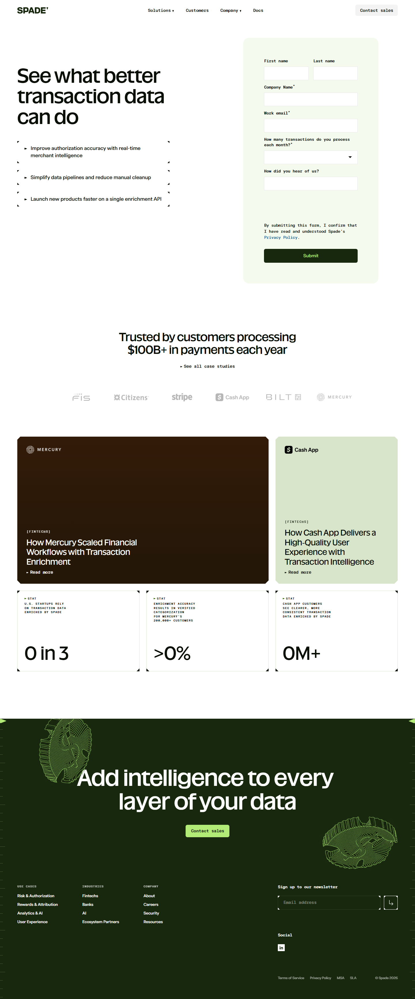

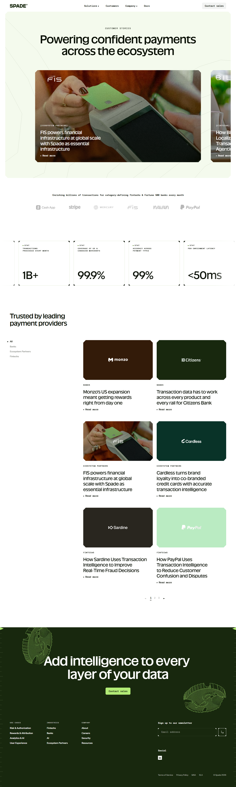







### Section Clips (screens/sections/)

*Clipped individual sections and components*

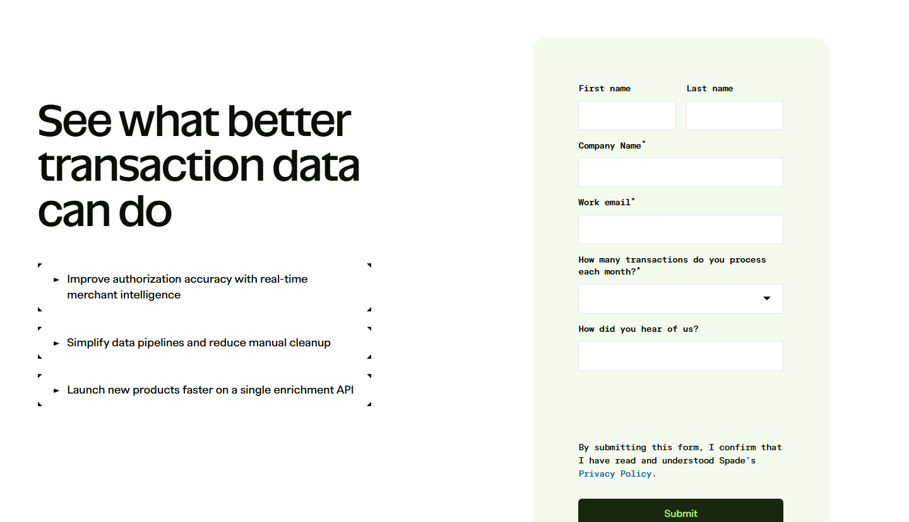

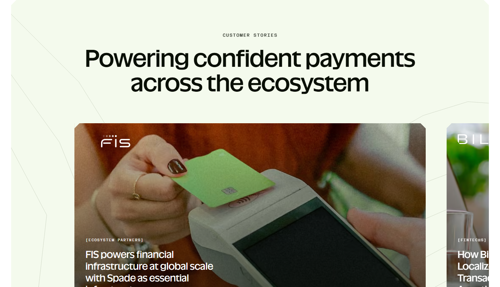

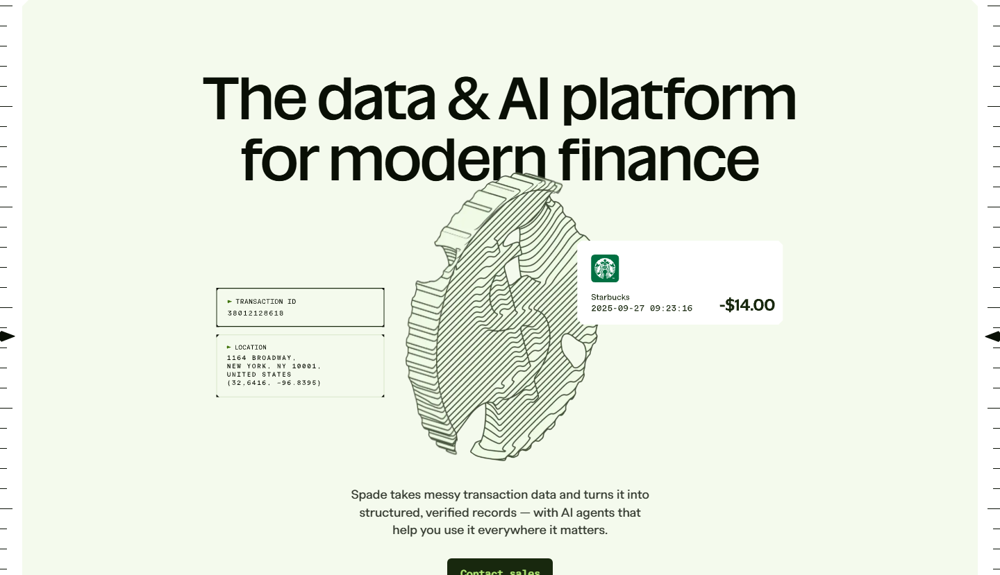

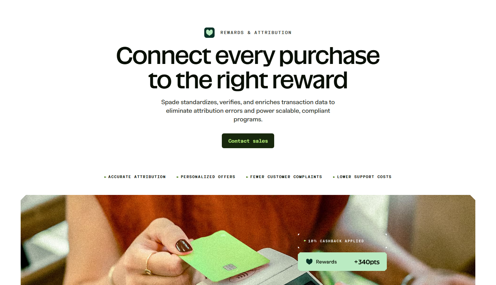

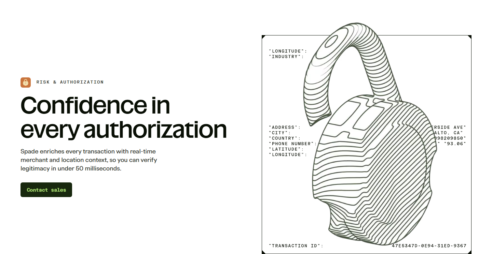


### Interaction States (screens/states/)

*Hover, focus, and active state captures*

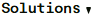


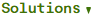

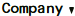


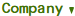


### Screenshot Index (screens/INDEX.md)

# Screenshot Index

## Scroll Journey

> Shows the cinematic state at each point of the page

| Scroll | Y Position | File |
|--------|-----------|------|
| 0% | 0px | `screens/scroll/scroll-000.png` |
| 17% | 2242px | `screens/scroll/scroll-017.png` |
| 33% | 4352px | `screens/scroll/scroll-033.png` |
| 50% | 6594px | `screens/scroll/scroll-050.png` |
| 67% | 8836px | `screens/scroll/scroll-067.png` |
| 83% | 10946px | `screens/scroll/scroll-083.png` |
| 100% | 13188px | `screens/scroll/scroll-100.png` |

## Pages

| Page | URL | File |
|------|-----|------|
| The data & AI platform for modern finance | Spade | `https://spade.com/` | `screens/pages/home.png` |
| Customers | Spade | `https://spade.com/customers/` | `screens/pages/customers.png` |
| Contact | Spade | `https://spade.com/contact/` | `screens/pages/contact.png` |
| Risk & Authorization | Spade | `https://spade.com/use-case/risk-authorization/` | `screens/pages/use-case-risk-authorization.png` |
| Rewards & Attribution | Spade | `https://spade.com/use-case/rewards-and-attribution/` | `screens/pages/use-case-rewards-and-attribution.png` |

## Sections

| Page | Section | File |
|------|---------|------|
| home | #1 (section) | `screens/sections/home-section-1.png` |
| customers | #1 (section) | `screens/sections/customers-section-1.png` |
| contact | #1 (section) | `screens/sections/contact-section-1.png` |
| use-case-risk-authorization | #1 (section) | `screens/sections/use-case-risk-authorization-section-1.png` |
| use-case-risk-authorization | #2 (section) | `screens/sections/use-case-risk-authorization-section-2.png` |
| use-case-rewards-and-attribution | #1 (section) | `screens/sections/use-case-rewards-and-attribution-section-1.png` |

## Homepage Screenshots (screenshots/)


