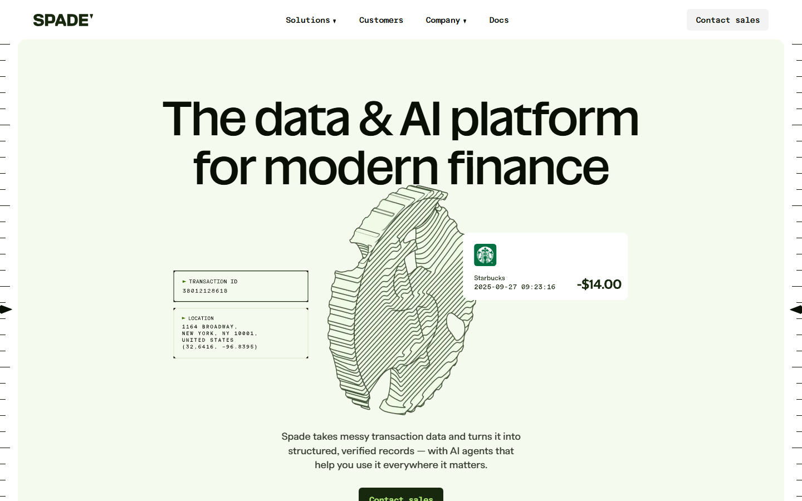
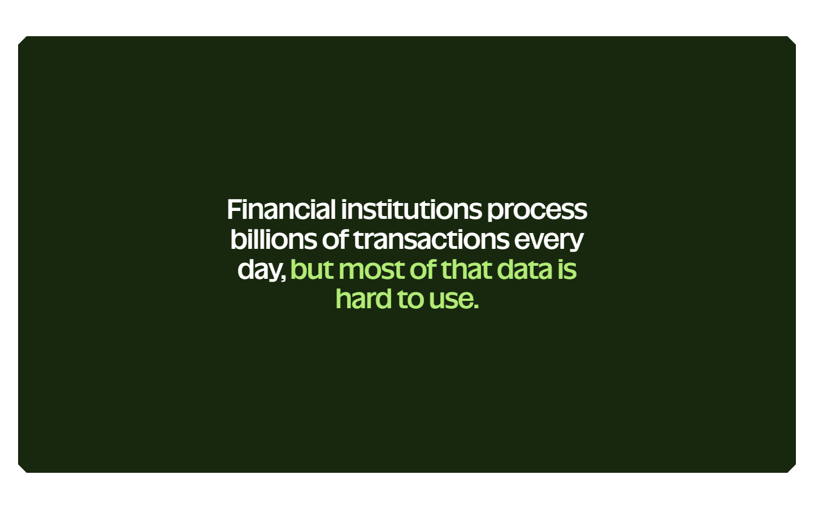
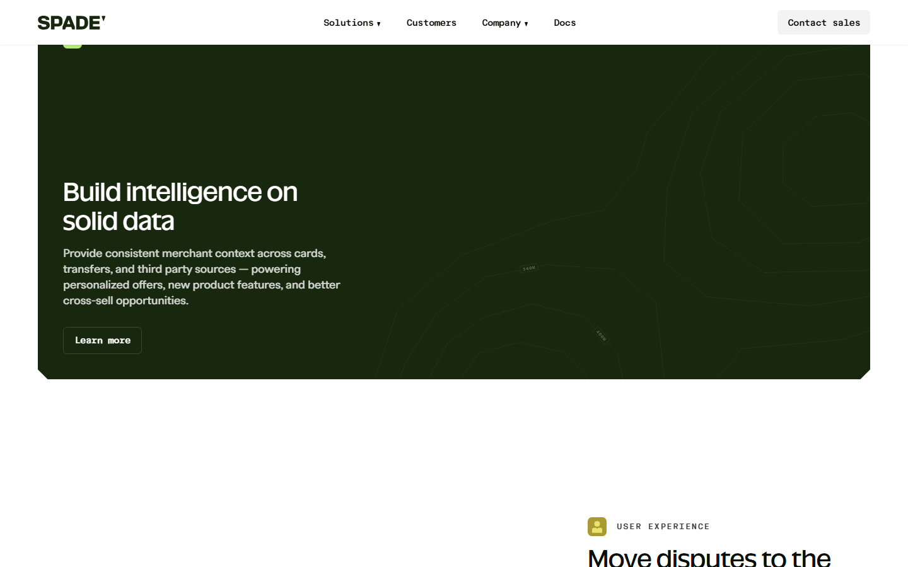
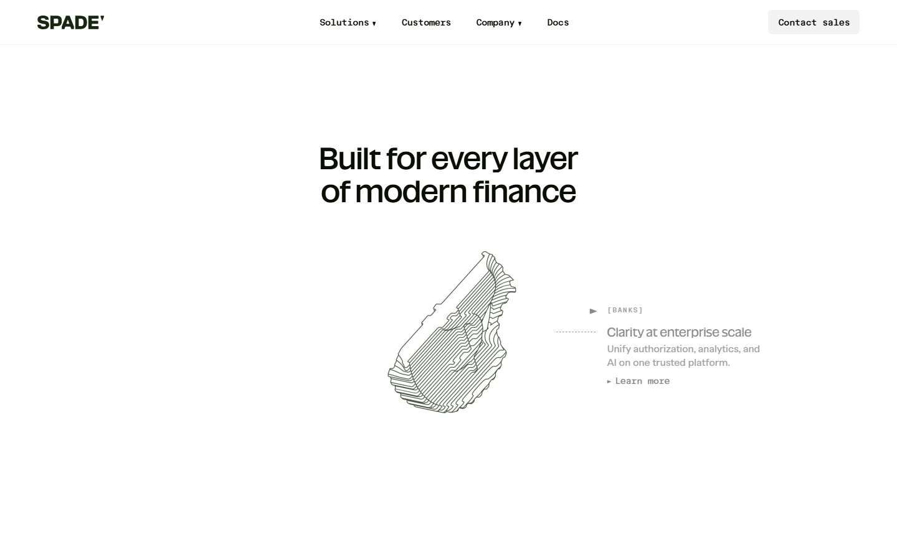
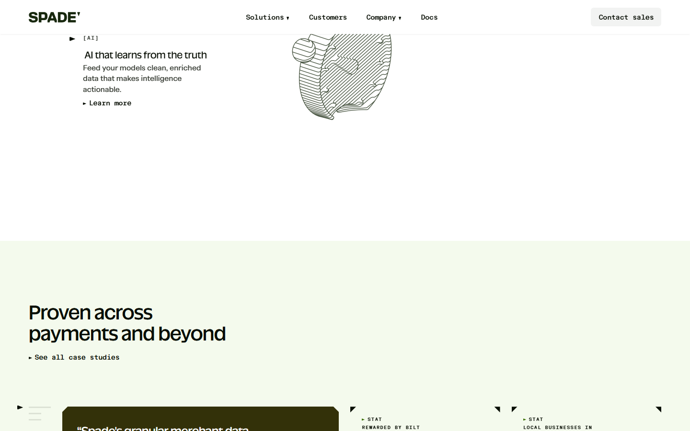
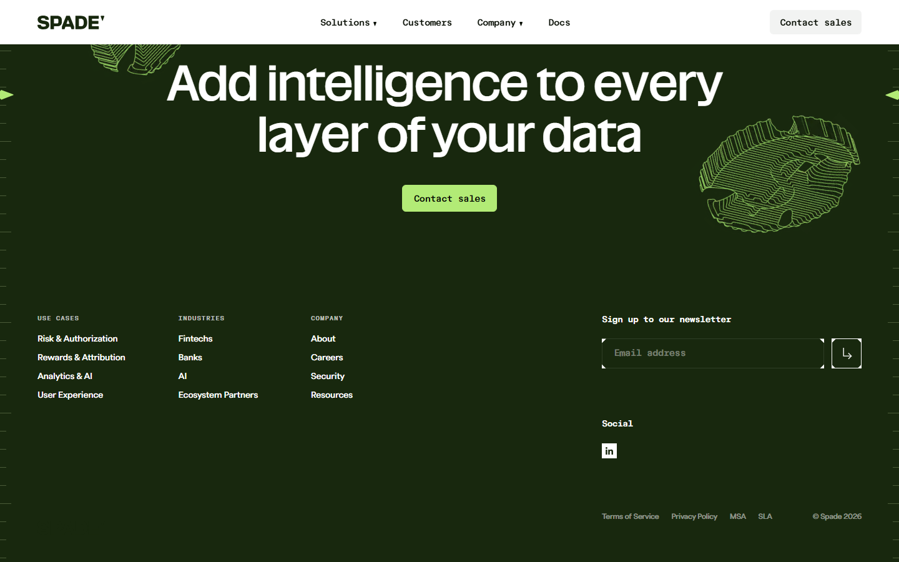

# Animation Reference

> Cinematic motion design extracted from live DOM. Follow these specs exactly to recreate the experience.

## Motion Technology Stack

| Library | Type | Notes |
|---------|------|-------|
| Canvas (1 elements) | 2D Canvas | 2D canvas rendering |

## Scroll Journey

The page is **14,088px** tall. Each frame below shows what the user sees at that scroll depth.

> **Use these screenshots to understand WHAT animates, WHEN it animates, and HOW it moves.**

### 0% — Top / Hero
Scroll position: 0px



### 17% — Opening Section
Scroll position: 2,242px



### 33% — First Feature Section
Scroll position: 4,352px


### 50% — Mid-Page
Scroll position: 6,594px



### 67% — Lower Content
Scroll position: 8,836px



### 83% — Near Footer
Scroll position: 10,946px



### 100% — Bottom / Footer
Scroll position: 13,188px



## Video Elements

| # | Role | Autoplay | Loop | Muted | Size | First Frame |
|---|------|----------|------|-------|------|-------------|
| 1 | content | — | — | ✓ | 340×360 | — |

- **Source:** `blob:https://spade.com/c16ff774-f433-4bf6-9a5c-db6c28347d4d`

## Scroll Animation Patterns

| Pattern | Library | Element Count | Duration | Delay | Easing |
|---------|---------|---------------|----------|-------|--------|
| parallax / sticky scroll | CSS | 4 | — | — | — |

### CSS Implementation

## CSS Keyframes (2 extracted)

### `@keyframes swiper-preloader-spin`

Duration: `1s` · Easing: `linear` · Delay: `0s` · Iteration: `infinite` · Fill: `none`

Used by: `:is(.swiper:not(.swiper-watch-progress), .swiper-watch-progress .swiper-slide-vi`

```css
@keyframes swiper-preloader-spin {
  0% {
    transform: rotate(0deg);
  }
  100% {
    transform: rotate(360deg);
  }
}
```

> Transform/motion animation

### `@keyframes marquee`

```css
@keyframes marquee {
  0% {
    transform: translate(0px);
  }
  100% {
    transform: translate(calc(-100% - 2rem));
  }
}
```

> Transform/motion animation

## Motion Tokens (CSS Variables)

### Duration Tokens

```css
--default-transition-duration: .25s;
```

### Easing Tokens

```css
--default-transition-timing-function: cubic-bezier(.4,0,.2,1);
--ease-out: cubic-bezier(0,0,.2,1);
--ease-in-out: cubic-bezier(.4,0,.2,1);
```

## Global Transition Declarations

These `transition` values were extracted from CSS rules across the site:

```css
transition: opacity 0.2s;
```

## How to Recreate This Motion Design

### Step 2 — Scroll-Reveal Pattern

Elements that animate into view follow this pattern:

```css
/* Initial hidden state */
.reveal {
  opacity: 0;
  transform: translateY(40px);
  transition: opacity .25s cubic-bezier(.4,0,.2,1),
              transform .25s cubic-bezier(.4,0,.2,1);
}
.reveal.visible {
  opacity: 1;
  transform: translateY(0);
}
```

### Step 3 — Key Motion Principles

- **Canvas elements (1)** — animated via requestAnimationFrame loop. Use canvas for particle effects, gradient animations, and WebGL scenes
- **Duration scale:** `.25s` · `0.2s` — use these values, never invent new durations
- **Always add** `@media (prefers-reduced-motion: reduce) { * { animation-duration: 0.01ms !important; transition-duration: 0.01ms !important; } }`

### Step 4 — Scroll Journey Reference

Match what happens at each scroll position:

- **0%** (`0px`) → `screens/scroll/scroll-000.png`
- **17%** (`2242px`) → `screens/scroll/scroll-017.png`
- **33%** (`4352px`) → `screens/scroll/scroll-033.png`
- **50%** (`6594px`) → `screens/scroll/scroll-050.png`
- **67%** (`8836px`) → `screens/scroll/scroll-067.png`
- **83%** (`10946px`) → `screens/scroll/scroll-083.png`
- **100%** (`13188px`) → `screens/scroll/scroll-100.png`

